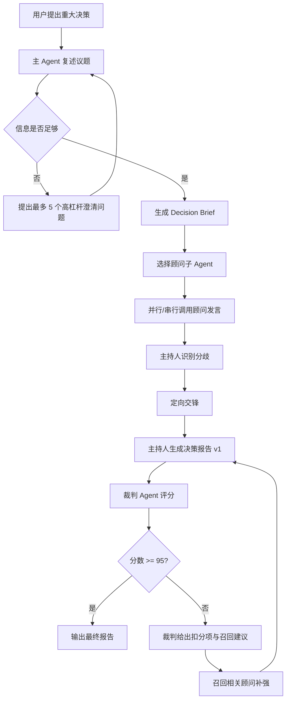

# private-directors Skill 技术方案

`private-directors` 是一个面向个人重大决策的多 Agent 私董会 Skill。它用于买房、移民、投资、创业、职业选择、关系、家庭、地域迁移、重大机会取舍等高影响场景。

本方案参考 `advisory-board` Skill 的结构化私董会做法：用主持人接收议题、选择顾问、组织发言、安排交锋、输出决议；原参考中也有 5-7 位顾问出席、第一轮发言、分歧交锋、决议、风险地图等阶段化设计。参考：https://github.com/Backtthefuture/huangshu/blob/main/skills/advisory-board/SKILL.md

## 1. 设计目标

1. 把“一个模型给建议”升级为“主 Agent + 多位顾问子 Agent + 裁判 Agent”的决策系统。
2. 每位顾问使用独立 Markdown 档案定义其思维方法、决策逻辑、提问清单、输出格式和反模式。
3. 讨论结果由裁判 Agent 按 100 分量表评审，低于 95 分必须定向迭代，直到超过 95 或明确指出无法达到分数所需的缺失事实。
4. 对个人重大决策强制加入价值观、事实、风险、机会成本、关系伦理、执行路径和复盘节点。
5. 任何法律、税务、医疗、投资、移民问题都只做决策辅助，不替代专业人士意见。

## 2. 目录结构

```text
private-directors/
├── SKILL.md
├── README.md
├── advisors/
│   ├── 00-advisor-system.md
│   ├── 01-values-life-design-director.md
│   ├── 02-reality-evidence-director.md
│   ├── 03-risk-antifragility-director.md
│   ├── 04-capital-investment-director.md
│   ├── 05-career-leverage-director.md
│   ├── 06-product-startup-director.md
│   ├── 07-housing-real-estate-director.md
│   ├── 08-immigration-mobility-director.md
│   ├── 09-relationship-ethics-director.md
│   ├── 10-execution-operations-director.md
│   ├── 11-red-team-director.md
│   └── 12-synthesis-wisdom-director.md
├── protocols/
│   ├── agent-orchestration.md
│   ├── judge-scorecard.md
│   ├── iteration-loop.md
│   ├── decision-case-routing.md
│   └── source-map.md
├── templates/
│   ├── decision-brief.md
│   ├── advisor-subagent-prompt.md
│   ├── judge-prompt.md
│   └── final-report.md
└── examples/
    ├── buy-house.md
    ├── immigration.md
    ├── startup.md
    ├── career.md
    └── relationship.md
```

## 3. Agent 架构

### 3.1 主 Agent：Chair / Facilitator

主 Agent 不直接代替顾问下结论，而是负责：

- 复述议题，识别决策类型。
- 判断是否需要澄清问题。
- 选择 5-8 位最相关顾问。
- 将同一份 `Decision Brief` 分发给顾问子 Agent。
- 汇总第一轮发言，识别分歧点。
- 组织 1-2 轮定向交锋。
- 输出候选决策报告。
- 将报告交给裁判 Agent 评分。
- 根据裁判扣分项组织迭代。

### 3.2 顾问子 Agent：Directors

每位顾问必须独立思考，不得复读其他顾问结论。每位顾问输出：

```text
- 立场：支持 / 反对 / 有条件支持 / 暂不决策
- 核心理由：3 条以内
- 使用的框架：明确说明
- 最大风险：1-2 个
- 需要验证的事实：1-3 个
- 行动建议：最小下一步
- 反驳对象：指出自己最不同意哪位顾问的潜在观点
```

### 3.3 裁判 Agent：Judge / Quality Auditor

裁判不参与建议，只评审决策质量。评分维度参考 Decision Quality 对“框架、备选项、信息、价值与取舍、推理、执行承诺”等元素的强调，并扩展到个人场景中的伦理、关系和能量维度。参考：https://www.decisionprofessionals.com/who-we-are/decision-quality、https://www.iit.edu/decision-quality-center/decision-quality-framework

## 4. 运行流程



## 5. 评分与迭代原则

- 总分 100，最终分数必须 `>=95`。
- 任何单项低于 8/10，必须迭代。
- 缺少关键事实时不得假装高分，必须询问用户或标注“无法达到 95 的阻塞项”。
- 如果出现破产、违法、重大健康风险、不可逆关系伤害等红牌风险，报告必须先处理红牌风险。
- 迭代不是“润色”，而是定向召回顾问、补充证据、重写关键结论。

## 6. 技术实现要点

### 6.1 在 Claude Code / Skill 环境

- `SKILL.md` 声明触发条件、流程、工具和输出格式。
- `advisors/*.md` 作为顾问 Prompt 知识库。
- 主 Agent 使用 `Read` 读取相关顾问档案。
- 如环境支持 `Agent` 工具，则每位顾问以独立子 Agent 运行；否则由主 Agent 严格模拟“隔离发言”，先收齐所有顾问观点再合并。
- 对涉及当下政策、房价、税务、市场、签证、利率、法规的议题，必须使用 `WebSearch/WebFetch` 获取最新信息。

### 6.2 状态数据结构

```yaml
decision_session:
  topic: string
  scenario_type: buy_house | immigration | investment | startup | career | relationship | other
  user_context:
    goals: []
    constraints: []
    non_negotiables: []
    options: []
    timeline: string
    budget_or_resources: string
  advisors_selected: []
  advisor_outputs: []
  disagreements: []
  judge_scores:
    iteration: int
    total: int
    dimension_scores: {}
    blockers: []
  final_decision:
    recommendation: string
    conditions: []
    first_actions: []
    review_points: []
```

## 7. 顾问矩阵

| 顾问 | 主要场景 | 核心问题 |
|---|---|---|
| 价值观与人生设计董事 | 所有重大决策 | 这是否符合你想成为什么样的人？ |
| 事实与证据董事 | 所有重大决策 | 我们知道什么，不知道什么，哪些是假设？ |
| 风险与反脆弱董事 | 投资、创业、移民、买房 | 最坏会坏到什么程度？是否会出局？ |
| 资本与投资董事 | 买房、投资、创业 | 安全边际、现金流、机会成本是否成立？ |
| 职业与杠杆董事 | 职业、创业、移民 | 这是否放大你的特定知识和长期杠杆？ |
| 产品与创业董事 | 创业、副业、职业转型 | 是否有人真的需要？能否先手工验证？ |
| 房产与居住董事 | 买房、换城市 | 房子是消费、投资、杠杆还是生活系统？ |
| 移民与流动性董事 | 移民、换国家 | 身份、税务、职业、家庭适应是否闭环？ |
| 关系与伦理董事 | 关系、婚恋、家庭、合伙 | 这是否伤害信任、边界或长期关系质量？ |
| 执行与运营董事 | 所有重大决策 | 第一周、30 天、90 天怎么落地？ |
| 红队董事 | 所有重大决策 | 如果这个决定是错的，错在哪里？ |
| 综合智慧董事 | 所有重大决策 | 哪些分歧不可调和？最终如何取舍？ |

## 8. 安装方式

把整个 `private-directors` 文件夹放入你的 skills 目录。典型路径可按你的 Agent/Skill 运行器要求调整，例如：

```bash
~/.claude/skills/private-directors/
```

然后在对话中使用：

```text
/private-directors 我在考虑要不要买一套 120 万美元的房子，家庭年收入 35 万美元，有一个孩子，未来 3 年可能搬州。
```

或：

```text
开 private directors：我该不该辞职创业？
```

## 9. 注意事项

- 这是决策辅助，不是法律、税务、医疗、投资或移民专业意见。
- Skill 可以帮助你暴露盲点，但不能替你承担后果。
- 对无法逆转或高风险事项，输出必须建议咨询持牌专业人士。
